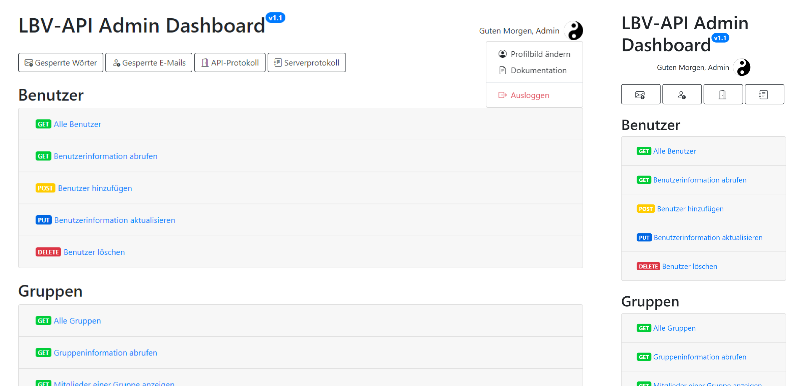
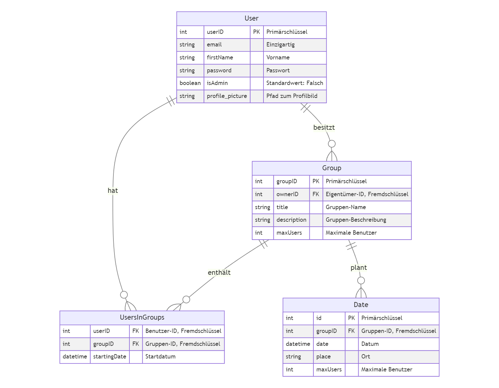

# LBV - Lerngruppen Bildung und Verwaltung API


Die LBV (Lerngruppen Bildung und Verwaltung) API ist eine RESTful-Webanwendung, die entwickelt wurde, um die Verwaltung von Lerngruppen und Benutzern zu erleichtern. Sie ermöglicht die Erstellung, Aktualisierung und Löschung von Benutzern, Gruppen, Terminen und Beziehungen zwischen Benutzern und Gruppen. Diese Dokumentation bietet eine umfassende Übersicht über die verfügbaren Endpunkte, ihre Verwendung und die erwarteten Datenstrukturen.

## Inhaltsverzeichnis

1. [Allgemeine Informationen](#allgemeine-informationen)
2. [Installation](#installation)
3. [Verwendung](#verwendung)
4. [Dashboard](#dashboard)
5. [Benutzer (Users)](#benutzer-users)
   - [Erstellen eines Benutzers](#erstellen-eines-benutzers)
   - [Erstellen eines Administrators](#erstellen-eines-administrators)
   - [Abrufen aller Benutzer](#abrufen-aller-benutzer)
   - [Abrufen eines einzelnen Benutzers](#abrufen-eines-einzelnen-benutzers)
   - [Aktualisieren eines Benutzers](#aktualisieren-eines-benutzers)
   - [Löschen eines Benutzers](#löschen-eines-benutzers)
6. [Profilbild (ProfilePicture)](#profilbild-profilepicture)
    - [Hochladen eines Profilbilds](#hochladen-eines-profilbilds)
    - [Herunterladen des Profilbilds](#herunterladen-des-profilbilds)
7. [Verbotene Wörter (blacklist)](#verbotene-wörter-blacklist)
    - [Abrufen der Blacklist](#abrufen-der-blacklist)
    - [Aktualisieren der Blacklist](#aktualisieren-der-blacklist)
8. [Gesperrte Benutzer (banned_emails)](#gesperrte-benutzer-banned_emails)
    - [Abrufen der Gesperrten E-Mails](#abrufen-der-gesperrten-e-mails)
    - [Aktualisieren der Gesperrten E-Mails](#aktualisieren-der-gesperrten-e-mails)
9. [Gruppen (Groups)](#gruppen-groups)
    - [Erstellen einer Gruppe](#erstellen-einer-gruppe)
    - [Abrufen aller Gruppen](#abrufen-aller-gruppen)
    - [Abrufen einer einzelnen Gruppe](#abrufen-einer-einzelnen-gruppe)
    - [Aktualisieren einer Gruppe](#aktualisieren-einer-gruppe)
    - [Löschen einer Gruppe](#löschen-einer-gruppe)
10. [Termine (Dates)](#termine-dates)
    - [Erstellen eines Termins](#erstellen-eines-termins)
    - [Abrufen aller Termine](#abrufen-aller-termine)
    - [Abrufen eines einzelnen Termins](#abrufen-eines-einzelnen-termins)
    - [Aktualisieren eines Termins](#aktualisieren-eines-termins)
    - [Löschen eines Termins](#löschen-eines-termins)
11. [Benutzer in Gruppen (UsersInGroups)](#benutzer-in-gruppen-usersingroups)
    - [Hinzufügen eines Benutzers zu einer Gruppe](#hinzufügen-eines-benutzers-zu-einer-gruppe)
    - [Abrufen aller Benutzer in einer Gruppe](#abrufen-aller-benutzer-in-einer-gruppe)
    - [Aktualisieren des Startdatums eines Benutzers in einer Gruppe](#aktualisieren-des-startdatums-eines-benutzers-in-einer-gruppe)
    - [Entfernen eines Benutzers aus einer Gruppe](#entfernen-eines-benutzers-aus-einer-gruppe)
12. [Authentifizierung](#authentifizierung)
13. [Tests](#tests)
14. [Öffentliche API](#öffentliche-api)
15. [API-Zugriffsprotokollierung](#api-zugriffsprotokollierung)


## Allgemeine Informationen

Die LBV-API wurde entwickelt, um die Verwaltung von Lerngruppen und Benutzern in einer Bildungsumgebung zu unterstützen. Sie bietet folgende Hauptfunktionen:

- **Benutzerverwaltung:** Erstellen, Aktualisieren, Abrufen und Löschen von Benutzerkonten.
- **Gruppenverwaltung:** Erstellen, Aktualisieren, Abrufen und Löschen von Lerngruppen.
- **Terminverwaltung:** Erstellen, Aktualisieren, Abrufen und Löschen von Terminen für Lerngruppen.
- **Verwaltung von Benutzern in Gruppen:** Hinzufügen, Abrufen, Aktualisieren und Entfernen von Benutzern in Gruppen.

Die API verwendet das JSON-Format für Anfragen und Antworten.

Die Authtifikation erfolgt über JWT-Token. Es gibt zwei verschiedene Arten von Benutzern: Administratoren und normale Benutzer. Administratoren haben erweiterte Rechte, wie z.B. das Löschen und Bearbeiten von Benutzerkonten.

Die LBV-API wurde mit Python und Flask entwickelt. Sie verwendet eine SQLite-Datenbank, um Benutzer- und Gruppendaten zu speichern.

### Aktuelles Deployment

Die LBV-Webschnittstelle ist öffentlich verfügbar unter https://lbv.digital/.

### Verwendete Technologien
- Python
- Bootstrap
- Flask
- SQLite
- SQLAlchemy
- JWT
- Nginx
- Supervisor
- Certbot
- Python logging
- Bcrypt

## Lokale Installation

Befolgen Sie diese Schritte, um die LBV-API auf Ihrem lokalen System einzurichten und auszuführen.

#### Schritt 1: Klonen des Repositories
Zuerst müssen Sie das LBV-API-Repository von GitHub auf Ihren Computer klonen. Öffnen Sie ein Terminal und führen Sie den folgenden Befehl aus:

```bash
git clone https://github.com/jexxme/groupManagementAPI
```

#### Schritt 2: Installieren der Abhängigkeiten
Wechseln Sie in das Verzeichnis des geklonten Repositories und installieren Sie die erforderlichen Python-Pakete mit pip. Diese Pakete sind in der `requirements.txt` Datei aufgelistet.

```bash
cd groupManagementAPI
pip install -r requirements.txt
```

#### Schritt 3: Einrichten der Umgebungsvariablen
Erstellen Sie eine `.env`-Datei im Wurzelverzeichnis des Projekts, um Ihre Umgebungsvariablen sicher zu speichern. Fügen Sie insbesondere den JWT Secret Key hinzu:

1. Erstellen Sie eine neue Datei namens `.env` im Hauptverzeichnis des Projekts.
2. Fügen Sie die folgende Zeile hinzu und ersetzen Sie `IhrGeheimerSchlüssel` durch Ihren eigenen sicheren Schlüssel:

   ```
   JWT_SECRET_KEY=IhrGeheimerSchlüssel
   ```

#### Schritt 4: Starten der Anwendung
Nachdem Sie die Umgebungsvariablen eingerichtet haben, können Sie die Anwendung starten. Führen Sie dazu den folgenden Befehl im Wurzelverzeichnis des Projekts aus:

```bash
python run.py
```


Die API sollte nun auf `http://localhost:5000` gestartet sein.

Das Dashboard ist unter `http://localhost:5000/` oder `http://localhost:5000/dashboard` erreichbar.

## Dashboard


Das Dashboard ist eine webbasierte Benutzeroberfläche für Administratoren, mit der Sie die LBV-API verwalten können. Es bietet eine Übersicht über die Datenbank und ermöglicht das Erstellen, Aktualisieren und Löschen von Benutzern, Gruppen, Terminen und Benutzern in Gruppen. Das Dashboard ist unter `http://localhost:5000/dashboard` verfügbar.

## Verwendung

Die LBV-API ermöglicht die Verwaltung von Benutzern, Gruppen, Terminen und Benutzern in Gruppen über RESTful-Endpunkte. Jeder Endpunkt akzeptiert HTTP-Anfragemethoden wie GET, POST, PUT und DELETE. Die API erwartet JSON-Daten in den Anfragen und gibt JSON-Antworten zurück.

### ERD
 

## Benutzer (Users)


### Erstellen eines Benutzers

- **Endpoint:** `/users`
- **Methode:** `POST`

Erstellt einen neuen Benutzer. Die E-Mail-Adresse des Benutzers muss das Format `@gso.schule.koeln` aufweisen. Außerdem wird überprüft, ob die E-Mail-Adresse bereits existiert. Wenn ja, wird ein Fehler zurückgegeben.

**Anforderungs-JSON-Format:**

```json
{
    "email": "benutzer@gso.schule.koeln",
    "firstName": "Vorname",
    "password": "Passwort"
}
```

**Erfolgsantwort:**

- **Code:** 201 (Created)
- **Inhalt:** 
  ```json
  { "message": "Neuer Benutzer erstellt" }
  ```

**Fehlerantwort bei ungültiger E-Mail-Adresse:**

- **Code:** 400 (Bad Request)
- **Inhalt:** 
  ```json
  { "message": "Es sind nur E-Mails von @gso.schule.koeln erlaubt" }
  ```

**Fehlerantwort bei bereits existierender E-Mail-Adresse:**

- **Code:** 409 (Conflict)
- **Inhalt:** 
  ```json
  { "message": "Ein Benutzer mit dieser E-Mail-Adresse existiert bereits" }
  ```

**Beispiel:**

- **Anfrage:**

  ```json
  {
      "email": "max.mustermann@gso.schule.koeln",
      "firstName": "Max",
      "password": "meinPasswort123"
  }
  ```

- **Antwort bei Erfolg:**

  ```json
  { "message": "Neuer Benutzer erstellt" }
  ```

- **Antwort bei ungültiger E-Mail-Adresse:**

  ```json
  { "message": "Es sind nur E-Mails von @gso.schule.koeln erlaubt" }
  ```

- **Antwort bei bereits existierender E-Mail-Adresse:**

  ```json
  { "message": "Ein Benutzer mit dieser E-Mail-Adresse existiert bereits" }
  ```

---


### Erstellen eines Administrators

- **Endpoint:** `/admin`
- **Methode:** `POST`

Erstellt einen neuen Administrator. Diese Aktion erfordert Administratorrechte. Gibt eine Bestätigungsnachricht zurück, wenn der Administrator erfolgreich erstellt wurde.

**Anforderungen:**

- Der anfragende Benutzer muss über Administratorrechte verfügen.
- Die Anfrage muss über einen gültigen JWT-Token mit entsprechenden Administratorrechten verfügen.
- Für mehr Details siehe [Authentifizierung](#authentifizierung).

**Anforderungs-JSON-Format:**

```json
{
    "email": "admin@example.com",
    "firstName": "Admin",
    "password": "sicheresPasswort"
}
```

**Erfolgsantwort:**

- **Code:** 201 (Created)
- **Inhalt:** 
  ```json
  { "message": "Neuer Admin erstellt" }
  ```

**Fehlerantwort:**

- **Code:** 401 (Unauthorized) / 403 (Forbidden)
- **Inhalt:** 
  ```json
  { "message": "Unauthorized: Administratorrechte erforderlich" }
  ```

**Beispiel:**

- **Anfrage:**

  ```json
  {
      "email": "neuer.admin@example.com",
      "firstName": "NeuerAdmin",
      "password": "adminPasswort123"
  }
  ```

- **Antwort bei Erfolg:**

  ```json
  { "message": "Neuer Admin erstellt" }
  ```

- **Antwort bei fehlender Autorisierung:**

  ```json
  { "message": "Unauthorized: Administratorrechte erforderlich" }
  ```

---

### Abrufen aller Benutzer

- **Endpoint:** `/users`
- **Methode:** `GET`

Ruft eine Liste aller Benutzer ab. Jeder Benutzer wird mit seiner Benutzer-ID, E-Mail-Adresse, dem Vornamen, dem Passwort und seinem Admin-Status zurückgegeben.

**Anforderungen:**

- Wird noch herausgefunden...

**Erfolgsantwort:**

- **Code:** 200 (OK)
- **Inhalt:** Liste aller Benutzer in JSON-Format
  ```json
  [
      {
          "userID": 1,
          "email": "benutzer1@example.com",
          "firstName": "Max",
          "password": "passwort123",
          "isAdmin": false
      },
      {
          "userID": 2,
          "email": "benutzer2@example.com",
          "firstName": "Anna",
          "password": "passwort321",
          "isAdmin": true
      }
      // Weitere Benutzer...
  ]
  ```

**Beispiel für die Verwendung:**

Eine GET-Anfrage an den Endpoint `/users` liefert die Liste aller Benutzer in der Datenbank:

```bash
curl -X GET http://127.0.0.1:5000/users
```

---

### Abrufen eines einzelnen Benutzers

- **Endpoint:** `/users/<userID>`
- **Methode:** `GET`

Gibt die Details eines einzelnen Benutzers anhand seiner `userID` zurück.

---

### Aktualisieren eines Benutzers

- **Endpoint:** `/users/<userID>`
- **Methode:** `PUT`

Aktualisiert die Details eines Benutzers anhand seiner `userID`. Geben Sie die zu aktualisierenden Felder im JSON-Format an.

**JSON-Daten:**

```json
{
    "email": "neue-email@example.com",
    "firstName": "Neuer Vorname",
    "password": "neuesPasswort123",
    "isAdmin": true
}
```

---

### Löschen eines Benutzers

- **Endpoint:** `/users/<userID>`
- **Methode:** `DELETE`

Löscht einen Benutzer anhand seiner `userID`.

## Profilbild (ProfilePicture)

### Hochladen eines Profilbilds

- **Endpoint:** `/upload_profile_picture`
- **Methode:** `POST`
- **Berechtigung:** Erforderliche JWT-Token (jwt_required)

Diese Route ermöglicht das Hochladen eines Profilbilds für den aktuellen Benutzer. Der Benutzer muss authentifiziert sein und ein gültiges JWT-Token bereitstellen. Die Berechtigungen werden über das Token überprüft.

**Anforderungs-Formulardaten:**

- `user_id` (Benutzer-ID): Die Benutzer-ID, für den das Profilbild hochgeladen werden soll.

**Erfolgsantwort:**

- **Code:** 200 (OK)
- **Inhalt:** 
  ```json
  { "message": "Profilbild erfolgreich hochgeladen" }
  ```

**Fehlerantwort bei fehlender Benutzer-ID:**

- **Code:** 400 (Bad Request)
- **Inhalt:** 
  ```json
  { "message": "Benutzer-ID fehlt" }
  ```

**Fehlerantwort bei fehlenden Dateidaten:**

- **Code:** 400 (Bad Request)
- **Inhalt:** 
  ```json
  { "message": "Kein Dateiteil vorhanden" }
  ```

**Fehlerantwort bei keiner ausgewählten Datei:**

- **Code:** 400 (Bad Request)
- **Inhalt:** 
  ```json
  { "message": "Keine ausgewählte Datei" }
  ```

**Fehlerantwort bei ungültigem Dateityp oder Größe:**

- **Code:** 400 (Bad Request)
- **Inhalt:** 
  ```json
  { "message": "Ungültiger Dateityp oder Größe" }
  ```

**Fehlerantwort bei fehlender Berechtigung:**

- **Code:** 403 (Forbidden)
- **Inhalt:** 
  ```json
  { "message": "Nicht berechtigt, das Profilbild dieses Benutzers zu ändern" }
  ```

**Beispiel:**

- **Anforderungs-Formulardaten:**

  ```
  user_id: 5
  file: [ausgewählte Datei]
  ```

- **Erfolgsantwort:**

  ```json
  { "message": "Profilbild erfolgreich hochgeladen" }
  ```

- **Fehlerantwort bei fehlender Benutzer-ID:**

  ```json
  { "message": "Benutzer-ID fehlt" }
  ```

- **Fehlerantwort bei fehlenden Dateidaten:**

  ```json
  { "message": "Kein Dateiteil vorhanden" }
  ```

- **Fehlerantwort bei keiner ausgewählten Datei:**

  ```json
  { "message": "Keine ausgewählte Datei" }
  ```

- **Fehlerantwort bei ungültigem Dateityp oder Größe:**

  ```json
  { "message": "Ungültiger Dateityp oder Größe" }
  ```

- **Fehlerantwort bei fehlender Berechtigung:**

  ```json
  { "message": "Nicht berechtigt, das Profilbild dieses Benutzers zu ändern" }
  ```

---

### Herunterladen des Profilbilds

- **Endpoint:** `/profile_picture/<int:user_id>`
- **Methode:** `GET`

Diese Route ermöglicht das Herunterladen des Profilbilds eines bestimmten Benutzers anhand seiner Benutzer-ID.

**Parameter:**

- `user_id` (Benutzer-ID): Die eindeutige ID des Benutzers, dessen Profilbild heruntergeladen werden soll.

**Erfolgsantwort:**

- Das Profilbild des Benutzers wird als Datei heruntergeladen.

**Fehlerantwort bei nicht gefundenem Profilbild:**

- **Code:** 404 (Not Found)
- **Inhalt:** 
  ```json
  { "message": "Profilbild nicht gefunden" }
  ```

**Beispiel:**

- **Anfrage:** `/profile_picture/5`

- **Erfolgsantwort:** Das Profilbild des Benutzers mit der ID 5 wird als Datei heruntergeladen.

- **Fehlerantwort bei nicht gefundenem Profilbild:**

  ```json
  { "message": "Profilbild nicht gefunden" }
  ```

## Verbotene Wörter (blacklist)

### Abrufen der Blacklist

- **Endpoint:** `/blacklist`
- **Methode:** `GET`

Diese Route ermöglicht das Abrufen der aktuellen Blacklist, die von Administratoren verwaltet wird. Die Blacklist enthält gesperrte Benutzer oder Entitäten.

**Erfolgsantwort:**

- **Code:** 200 (OK)
- **Inhalt:** Eine Liste der Einträge in der Blacklist.

**Fehlerantwort bei nicht gefundenem Blacklist-Datei:**

- **Code:** 404 (Not Found)
- **Inhalt:** 
  ```json
  { "message": "Blacklist-Datei nicht gefunden" }
  ```

**Beispiel:**

- **Erfolgsantwort:**

  ```json
  {
      "blacklist": [
          "gesperrter_benutzer1",
          "gesperrter_benutzer2",
          "gesperrte_entität1"
      ]
  }
  ```

- **Fehlerantwort bei nicht gefundenem Blacklist-Datei:**

  ```json
  { "message": "Blacklist-Datei nicht gefunden" }
  ```

---

### Aktualisieren der Blacklist

- **Endpoint:** `/blacklist`
- **Methode:** `PUT`

Diese Route ermöglicht das Aktualisieren der Blacklist, die von Administratoren verwaltet wird. Die Blacklist enthält gesperrte Benutzer oder Entitäten.

**Anforderungs-JSON-Format:**

```json
{
    "blacklist": ["gesperrter_benutzer1", "gesperrter_benutzer2"]
}
```

**Erfolgsantwort:**

- **Code:** 200 (OK)
- **Inhalt:** 
  ```json
  { "message": "Blacklist erfolgreich aktualisiert" }
  ```

**Fehlerantwort bei ungültiger Anfrage:**

- **Code:** 400 (Bad Request)
- **Inhalt:** 
  ```json
  { "message": "Bitte geben Sie eine 'blacklist' Nutzlast an." }
  ```

- **Code:** 400 (Bad Request)
- **Inhalt:** 
  ```json
  { "message": "Die 'blacklist' muss eine Liste von Wörtern sein." }
  ```

**Fehlerantwort bei Fehler beim Aktualisieren der Blacklist-Datei:**

- **Code:** 500 (Internal Server Error)
- **Inhalt:** 
  ```json
  { "message": "Beim Aktualisieren der Blacklist ist ein Fehler aufgetreten" }
  ```

**Beispiel:**

- **Anfrage:**

  ```json
  {
      "blacklist": ["gesperrter_benutzer1", "gesperrter_benutzer2"]
  }
  ```

- **Erfolgsantwort:**

  ```json
  { "message": "Blacklist erfolgreich aktualisiert" }
  ```

- **Fehlerantwort bei ungültiger Anfrage (fehlende Nutzlast):**

  ```json
  { "message": "Bitte geben Sie eine 'blacklist' Nutzlast an." }
  ```

- **Fehlerantwort bei ungültiger Anfrage (ungültiges Format der 'blacklist'):**

  ```json
  { "message": "Die 'blacklist' muss eine Liste von Wörtern sein." }
  ```

- **Fehlerantwort bei Fehler beim Aktualisieren der Blacklist-Datei:**

  ```json
  { "message": "Beim Aktualisieren der Blacklist ist ein Fehler aufgetreten" }
  ```

## Gesperrte Benutzer (banned_emails)

### Abrufen der Gesperrten E-Mails

- **Endpoint:** `/banned_emails`
- **Methode:** `GET`

Diese Route ermöglicht das Abrufen der Liste der gesperrten E-Mail-Adressen. Die Liste enthält E-Mail-Adressen, die aufgrund von Verstoß gegen die Nutzungsrichtlinien gesperrt wurden.

**Erfolgsantwort:**

- **Code:** 200 (OK)
- **Inhalt:** 
  ```json
  { "banned_emails": ["gesperrte_email1@example.com", "gesperrte_email2@example.com"] }
  ```

**Fehlerantwort bei Nichtgefundenem Datei:**

- **Code:** 404 (Not Found)
- **Inhalt:** 
  ```json
  { "message": "Datei mit gesperrten E-Mails nicht gefunden" }
  ```

**Beispiel:**

- **Erfolgsantwort:**

  ```json
  { "banned_emails": ["gesperrte_email1@example.com", "gesperrte_email2@example.com"] }
  ```

- **Fehlerantwort bei Nichtgefundenem Datei:**

  ```json
  { "message": "Datei mit gesperrten E-Mails nicht gefunden" }
  ```

---

### Aktualisieren der Gesperrten E-Mails

- **Endpoint:** `/banned_emails`
- **Methode:** `PUT`

Diese Route ermöglicht das Aktualisieren der Liste der gesperrten E-Mail-Adressen. Die Liste enthält E-Mail-Adressen, die aufgrund von Verstoß gegen die Nutzungsrichtlinien gesperrt wurden. Sie können eine neue Liste von gesperrten E-Mails senden, um die bestehende Liste zu ersetzen.

**Anforderungs-JSON-Format:**

```json
{
    "banned_emails": ["gesperrte_email1@example.com", "gesperrte_email2@example.com"]
}
```

**Erfolgsantwort:**

- **Code:** 200 (OK)
- **Inhalt:** 
  ```json
  { "message": "Gesperrte E-Mails erfolgreich aktualisiert" }
  ```

**Fehlerantwort bei fehlender Nutzlast oder ungültigem Format:**

- **Code:** 400 (Bad Request)
- **Inhalt:** 
  ```json
  { "message": "Bitte geben Sie eine 'banned_emails' Nutzlast an." }
  ```
  oder
  ```json
  { "message": "Die 'banned_emails' muss eine Liste von E-Mails sein." }
  ```

**Fehlerantwort bei Fehler beim Aktualisieren:**

- **Code:** 500 (Internal Server Error)
- **Inhalt:** 
  ```json
  { "message": "Beim Aktualisieren der gesperrten E-Mails ist ein Fehler aufgetreten" }
  ```

**Beispiel:**

- **Anfrage:**

  ```json
  {
      "banned_emails": ["gesperrte_email3@example.com", "gesperrte_email4@example.com"]
  }
  ```

- **Erfolgsantwort:**

  ```json
  { "message": "Gesperrte E-Mails erfolgreich aktualisiert" }
  ```

- **Fehlerantwort bei fehlender Nutzlast:**

  ```json
  { "message": "Bitte geben Sie eine 'banned_emails' Nutzlast an." }
  ```

- **Fehlerantwort bei ungültigem Format:**

  ```json
  { "message": "Die 'banned_emails' muss eine Liste von E-Mails sein." }
  ```

- **Fehlerantwort bei Fehler beim Aktualisieren:**

  ```json
  { "message": "Beim Aktualisieren der gesperrten E-Mails ist ein Fehler aufgetreten" }
  ```

## Gruppen (Groups)
### Erstellen einer neuen Gruppe

- **Endpoint:** `/groups`
- **Methode:** `POST`

Diese Route ermöglicht das Erstellen einer neuen Gruppe. Sie müssen als Benutzer authentifiziert sein, um eine Gruppe erstellen zu können. Sie müssen die folgenden Informationen im JSON-Format bereitstellen, um eine Gruppe zu erstellen:

**Anforderungs-JSON-Format:**

```json
{
    "ownerID": 1,
    "title": "Gruppenname",
    "description": "Beschreibung der Gruppe",
    "maxUsers": 10
}
```

- `ownerID`: Die Benutzer-ID des Gruppeneigentümers.
- `title`: Der Name der Gruppe.
- `description`: Eine Beschreibung der Gruppe.
- `maxUsers`: Die maximale Anzahl der Benutzer, die der Gruppe beitreten können.

**Erfolgsantwort:**

- **Code:** 201 (Created)
- **Inhalt:** 
  ```json
  { "message": "Neue Gruppe erstellt", "groupID": 123 }
  ```

  - `message`: Eine Erfolgsmeldung.
  - `groupID`: Die eindeutige ID der neu erstellten Gruppe.

**Fehlerantwort bei fehlenden Informationen oder ungültigem Format:**

- **Code:** 400 (Bad Request)
- **Inhalt:** 
  ```json
  { "message": "Bitte geben Sie alle erforderlichen Informationen an." }
  ```

**Beispiel:**

- **Anfrage:**

  ```json
  {
      "ownerID": 1,
      "title": "Meine Gruppe",
      "description": "Eine tolle Gruppe für alle!",
      "maxUsers": 20
  }
  ```

- **Erfolgsantwort:**

  ```json
  { "message": "Neue Gruppe erstellt", "groupID": 123 }
  ```

- **Fehlerantwort bei fehlenden Informationen:**

  ```json
  { "message": "Bitte geben Sie alle erforderlichen Informationen an." }
  ```

---
### Abrufen aller Gruppen

- **Endpoint:** `/groups`
- **Methode:** `GET`

Diese Route ermöglicht das Abrufen aller existierenden Gruppen. Es werden Informationen zu jeder Gruppe zurückgegeben, darunter:

- `groupID`: Die eindeutige ID der Gruppe.
- `ownerID`: Die Benutzer-ID des Gruppeneigentümers.
- `title`: Der Name der Gruppe.
- `description`: Eine Beschreibung der Gruppe.
- `maxUsers`: Die maximale Anzahl der Benutzer, die der Gruppe beitreten können.

**Erfolgsantwort:**

- **Code:** 200 (OK)
- **Inhalt:** 
  ```json
  [
    {
        "groupID": 1,
        "ownerID": 2,
        "title": "Gruppe 1",
        "description": "Beschreibung der Gruppe 1",
        "maxUsers": 10
    },
    {
        "groupID": 2,
        "ownerID": 3,
        "title": "Gruppe 2",
        "description": "Beschreibung der Gruppe 2",
        "maxUsers": 15
    }
  ]
  ```

**Beispiel:**

- **Erfolgsantwort:**

  ```json
  [
    {
        "groupID": 1,
        "ownerID": 2,
        "title": "Gruppe 1",
        "description": "Beschreibung der Gruppe 1",
        "maxUsers": 10
    },
    {
        "groupID": 2,
        "ownerID": 3,
        "title": "Gruppe 2",
        "description": "Beschreibung der Gruppe 2",
        "maxUsers": 15
    }
  ]
  ```

---
### Abrufen einer einzelnen Gruppe nach `groupID`

- **Endpoint:** `/groups/<groupID>`
- **Methode:** `GET`

Diese Route ermöglicht das Abrufen von Informationen zu einer einzelnen Gruppe anhand ihrer eindeutigen `groupID`. Es werden Informationen zur Gruppe zurückgegeben, darunter:

- `groupID`: Die eindeutige ID der Gruppe.
- `ownerID`: Die Benutzer-ID des Gruppeneigentümers.
- `title`: Der Name der Gruppe.
- `description`: Eine Beschreibung der Gruppe.
- `maxUsers`: Die maximale Anzahl der Benutzer, die der Gruppe beitreten können.

**Erfolgsantwort:**

- **Code:** 200 (OK)
- **Inhalt:** 
  ```json
  {
      "groupID": 1,
      "ownerID": 2,
      "title": "Gruppe 1",
      "description": "Beschreibung der Gruppe 1",
      "maxUsers": 10
  }
  ```

**Fehlerantwort bei nicht gefundener Gruppe:**

- **Code:** 404 (Not Found)
- **Inhalt:** 
  ```json
  { "message": "Gruppe nicht gefunden" }
  ```

**Beispiel:**

- **Erfolgsantwort:**

  ```json
  {
      "groupID": 1,
      "ownerID": 2,
      "title": "Gruppe 1",
      "description": "Beschreibung der Gruppe 1",
      "maxUsers": 10
  }
  ```

- **Fehlerantwort bei nicht gefundener Gruppe:**

  ```json
  { "message": "Gruppe nicht gefunden" }
  ```

---

### Aktualisieren einer Gruppe nach `groupID`

- **Endpoint:** `/groups/<groupID>`
- **Methode:** `PUT`

Diese Route ermöglicht das Aktualisieren von Informationen zu einer Gruppe anhand ihrer eindeutigen `groupID`. Die Aktualisierung kann nur vom Eigentümer der Gruppe oder von einem Administrator durchgeführt werden. Es können verschiedene Gruppendetails aktualisiert werden, darunter:

- `ownerID` (optional): Die Benutzer-ID des neuen Gruppeneigentümers.
- `title` (optional): Der neue Name der Gruppe.
- `description` (optional): Die neue Beschreibung der Gruppe.
- `maxUsers` (optional): Die maximale Anzahl der Benutzer, die der Gruppe beitreten können.

**Anforderungs-JSON-Format:**

```json
{
    "ownerID": 3,
    "title": "Neuer Gruppenname",
    "description": "Neue Gruppenbeschreibung",
    "maxUsers": 15
}
```

**Erfolgsantwort:**

- **Code:** 200 (OK)
- **Inhalt:** 
  ```json
  { "message": "Gruppe aktualisiert" }
  ```

**Fehlerantwort bei nicht autorisiertem Zugriff:**

- **Code:** 403 (Forbidden)
- **Inhalt:** 
  ```json
  { "message": "Sie sind nicht authorisiert um diese Gruppe zu bearbeiten!" }
  ```

**Fehlerantwort bei nicht gefundener Gruppe:**

- **Code:** 404 (Not Found)
- **Inhalt:** 
  ```json
  { "message": "Gruppe nicht gefunden" }
  ```

**Beispiel:**

- **Anfrage:**

  ```json
  {
      "title": "Neuer Gruppenname",
      "description": "Neue Gruppenbeschreibung",
      "maxUsers": 15
  }
  ```

- **Erfolgsantwort:**

  ```json
  { "message": "Gruppe aktualisiert" }
  ```

- **Fehlerantwort bei nicht autorisiertem Zugriff:**

  ```json
  { "message": "Sie sind nicht authorisiert um diese Gruppe zu bearbeiten!" }
  ```

- **Fehlerantwort bei nicht gefundener Gruppe:**

  ```json
  { "message": "Gruppe nicht gefunden" }
  ```

---

### Löschen einer Gruppe nach `groupID`

- **Endpoint:** `/groups/<groupID>`
- **Methode:** `DELETE`

Diese Route ermöglicht das Löschen einer Gruppe anhand ihrer eindeutigen `groupID`. Das Löschen kann nur vom Eigentümer der Gruppe oder von einem Administrator durchgeführt werden.

**Erfolgsantwort:**

- **Code:** 200 (OK)
- **Inhalt:** 
  ```json
  { "message": "Gruppe gelöscht" }
  ```

**Fehlerantwort bei nicht autorisiertem Zugriff:**

- **Code:** 403 (Forbidden)
- **Inhalt:** 
  ```json
  { "message": "Sie sind nicht authorisiert um diese Gruppe zu löschen!" }
  ```

**Fehlerantwort bei nicht gefundener Gruppe:**

- **Code:** 404 (Not Found)
- **Inhalt:** 
  ```json
  { "message": "Gruppe nicht gefunden" }
  ```

**Beispiel:**

- **Erfolgsantwort:**

  ```json
  { "message": "Gruppe gelöscht" }
  ```

- **Fehlerantwort bei nicht autorisiertem Zugriff:**

  ```json
  { "message": "Sie sind nicht authorisiert um diese Gruppe zu löschen!" }
  ```

- **Fehlerantwort bei nicht gefundener Gruppe:**

  ```json
  { "message": "Gruppe nicht gefunden" }
  ```

---

### Abrufen aller Mitglieder einer Gruppe nach `groupID`

- **Endpoint:** `/groups/<groupID>/members`
- **Methode:** `GET`

Diese Route ermöglicht das Abrufen aller Mitglieder einer Gruppe anhand ihrer eindeutigen `groupID`. Hierbei handelt es sich um eine geschützte Route, die eine JWT-Authentifizierung erfordert.

**Erfolgsantwort:**

- **Code:** 200 (OK)
- **Inhalt:** Eine Liste von Mitgliedern mit ihren Daten, wobei jeder Datensatz die `userID`, `groupID` und `startingDate` enthält.

**Fehlerantwort bei nicht autorisiertem Zugriff:**

- **Code:** 403 (Forbidden)
- **Inhalt:** 
  ```json
  { "message": "Sie sind nicht authorisiert um die Mitglieder dieser Gruppe abzurufen!" }
  ```

**Fehlerantwort bei nicht gefundener Gruppe:**

- **Code:** 404 (Not Found)
- **Inhalt:** 
  ```json
  { "message": "Gruppe nicht gefunden" }
  ```

**Beispiel:**

- **Erfolgsantwort:**

  ```json
  [
      {
          "userID": 1,
          "groupID": 123,
          "startingDate": "2023-01-15T10:30:00Z"
      },
      {
          "userID": 2,
          "groupID": 123,
          "startingDate": "2023-01-16T09:45:00Z"
      }
  ]
  ```

- **Fehlerantwort bei nicht autorisiertem Zugriff:**

  ```json
  { "message": "Sie sind nicht authorisiert um die Mitglieder dieser Gruppe abzurufen!" }
  ```

- **Fehlerantwort bei nicht gefundener Gruppe:**

  ```json
  { "message": "Gruppe nicht gefunden" }
  ```

## Termine (Dates)

### Erstellen eines Termins

- **Endpoint:** `/dates`
- **Methode:** `POST`

Diese Route ermöglicht das Erstellen eines neuen Termins für eine Gruppe. Die Route erfordert eine JWT-Authentifizierung.

**Anforderungs-JSON-Format:**

```json
{
    "groupID": 123,
    "date": "2023-01-20T14:30:00Z",
    "place": "Treffpunkt A",
    "maxUsers": 10
}
```

- `groupID`: Die eindeutige ID der Gruppe, für die der Termin erstellt werden soll.
- `date`: Das Datum und die Uhrzeit des Termins im ISO-8601-Format.
- `place`: Der Ort des Termins.
- `maxUsers`: Die maximale Anzahl von Benutzern, die an diesem Termin teilnehmen können.

**Erfolgsantwort:**

- **Code:** 201 (Created)
- **Inhalt:** 
  ```json
  { "message": "Neuer Termin erstellt" }
  ```

**Fehlerantwort bei ungültigem Datum:**

- **Code:** 400 (Bad Request)
- **Inhalt:** 
  ```json
  { "message": "Ungültiges Datumsformat" }
  ```

**Fehlerantwort bei nicht autorisierter Erstellung des Termins:**

- **Code:** 403 (Forbidden)
- **Inhalt:** 
  ```json
  { "message": "Sie sind nicht authorisiert einen Termin für diese Gruppe zu erstellen" }
  ```

**Beispiel:**

- **Anfrage:**

  ```json
  {
      "groupID": 123,
      "date": "2023-01-20T14:30:00Z",
      "place": "Treffpunkt A",
      "maxUsers": 10
  }
  ```

- **Antwort bei Erfolg:**

  ```json
  { "message": "Neuer Termin erstellt" }
  ```

- **Antwort bei ungültigem Datum:**

  ```json
  { "message": "Ungültiges Datumsformat" }
  ```

- **Antwort bei nicht autorisierter Erstellung des Termins:**

  ```json
  { "message": "Sie sind nicht authorisiert einen Termin für diese Gruppe zu erstellen" }
  ```


---

### Abrufen aller Termine

- **Endpoint:** `/dates`
- **Methode:** `GET`

Diese Route ermöglicht das Abrufen aller Termine aus der Datenbank. Die Route erfordert eine JWT-Authentifizierung.

**Erfolgsantwort:**

- **Code:** 200 (OK)
- **Inhalt:** Eine Liste aller Termine, wobei jeder Termin die folgenden Informationen enthält:
  ```json
  {
      "id": 1,
      "groupID": 123,
      "date": "2023-01-20T14:30:00Z",
      "place": "Treffpunkt A",
      "maxUsers": 10
  }
  ```

**Beispiel:**

- **Antwort bei Erfolg:**

  ```json
  [
      {
          "id": 1,
          "groupID": 123,
          "date": "2023-01-20T14:30:00Z",
          "place": "Treffpunkt A",
          "maxUsers": 10
      },
      {
          "id": 2,
          "groupID": 124,
          "date": "2023-02-15T16:00:00Z",
          "place": "Treffpunkt B",
          "maxUsers": 8
      }
  ]
  ```


---

### Abrufen eines einzelnen Termins anhand der DateID

- **Endpoint:** `/dates/<dateID>`
- **Methode:** `GET`

Diese Route ermöglicht das Abrufen eines einzelnen Termins anhand seiner DateID. Die Route erfordert eine JWT-Authentifizierung.

**Parameter:**

- `dateID`: Die eindeutige ID des gewünschten Termins.

**Erfolgsantwort:**

- **Code:** 200 (OK)
- **Inhalt:** Die Informationen des abgerufenen Termins, einschließlich:
  ```json
  {
      "id": 1,
      "groupID": 123,
      "date": "2023-01-20T14:30:00Z",
      "place": "Treffpunkt A",
      "maxUsers": 10
  }
  ```

**Fehlerantwort bei nicht gefundener DateID:**

- **Code:** 404 (Not Found)
- **Inhalt:** 
  ```json
  { "message": "Termin mit dieser ID wurde nicht gefunden" }
  ```

**Beispiel:**

- **Antwort bei Erfolg:**

  ```json
  {
      "id": 1,
      "groupID": 123,
      "date": "2023-01-20T14:30:00Z",
      "place": "Treffpunkt A",
      "maxUsers": 10
  }
  ```

- **Antwort bei nicht gefundener DateID:**

  ```json
  { "message": "Termin mit dieser ID wurde nicht gefunden" }
  ```


---

### Aktualisieren eines Termins

- **Endpoint:** `/dates/<dateID>`
- **Methode:** `PUT`

Diese Route ermöglicht das Aktualisieren eines Termins anhand seiner DateID. Die Route erfordert eine JWT-Authentifizierung.

**Parameter:**

- `dateID`: Die eindeutige ID des zu aktualisierenden Termins.

**Anforderungs-JSON-Format:**

Sie können jedes oder alle der folgenden Felder im JSON-Format senden, um die Informationen des Termins zu aktualisieren:

- `groupID` (optional): Die ID der Gruppe, zu der der Termin gehört.
- `date` (optional): Das Datum und die Uhrzeit des Termins im ISO-Format (z.B., "2023-01-20T14:30:00Z").
- `place` (optional): Der Ort des Termins.
- `maxUsers` (optional): Die maximale Anzahl von Teilnehmern für den Termin.

**Erfolgsantwort:**

- **Code:** 200 (OK)
- **Inhalt:** 
  ```json
  { "message": "Termin bearbeitet" }
  ```

**Fehlerantwort bei nicht gefundener DateID:**

- **Code:** 404 (Not Found)
- **Inhalt:** 
  ```json
  { "message": "Termin mit dieser ID wurde nicht gefunden" }
  ```

**Fehlerantwort bei ungültigem Datum:**

- **Code:** 400 (Bad Request)
- **Inhalt:** 
  ```json
  { "message": "Ungültiges Datumsformat" }
  ```

**Beispiel:**

- **Anfrage:**

  ```json
  {
      "date": "2023-01-25T15:00:00Z",
      "place": "Treffpunkt B",
      "maxUsers": 15
  }
  ```

- **Antwort bei Erfolg:**

  ```json
  { "message": "Termin bearbeitet" }
  ```

- **Antwort bei nicht gefundener DateID:**

  ```json
  { "message": "Termin mit dieser ID wurde nicht gefunden" }
  ```

- **Antwort bei ungültigem Datum:**

  ```json
  { "message": "Ungültiges Datumsformat" }
  ```
---

### Löschen eines Termins

- **Endpoint:** `/dates/<dateID>`
- **Methode:** `DELETE`

Diese Route ermöglicht das Löschen eines Termins anhand seiner DateID. Die Route erfordert eine JWT-Authentifizierung.

**Parameter:**

- `dateID`: Die eindeutige ID des zu löschenden Termins.

**Erfolgsantwort:**

- **Code:** 200 (OK)
- **Inhalt:** 
  ```json
  { "message": "Termin gelöscht" }
  ```

**Fehlerantwort bei nicht gefundener DateID:**

- **Code:** 404 (Not Found)
- **Inhalt:** 
  ```json
  { "message": "Termin mit dieser ID wurde nicht gefunden" }
  ```

**Fehlerantwort bei fehlenden Berechtigungen:**

- **Code:** 403 (Forbidden)
- **Inhalt:** 
  ```json
  { "message": "Sie sind nicht authorisiert diesen Termin zu löschen!" }
  ```

**Beispiel:**

- **Anfrage:**

  Kein spezifischer Inhalt erforderlich.

- **Antwort bei Erfolg:**

  ```json
  { "message": "Termin gelöscht" }
  ```

- **Antwort bei nicht gefundener DateID:**

  ```json
  { "message": "Termin mit dieser ID wurde nicht gefunden" }
  ```

- **Antwort bei fehlenden Berechtigungen:**

  ```json
  { "message": "Sie sind nicht authorisiert diesen Termin zu löschen!" }
  ```

## Benutzer in Gruppen (UsersinGroups)

### Erstellen eines neuen Benutzers in einer Gruppe

- **Endpoint:** `/users_in_groups`
- **Methode:** `POST`

Diese Route ermöglicht das Hinzufügen eines Benutzers zu einer Gruppe. Die Route erfordert eine JWT-Authentifizierung.

**Anforderungs-JSON-Format:**

```json
{
    "userID": "ID des Benutzers",
    "groupID": "ID der Gruppe"
}
```

**Erfolgsantwort:**

- **Code:** 201 (Created)
- **Inhalt:** 
  ```json
  { "message": "Benutzer wurde der Gruppe hinzugefügt" }
  ```

**Fehlerantwort bei nicht gefundener Benutzer-ID:**

- **Code:** 404 (Not Found)
- **Inhalt:** 
  ```json
  { "message": "Benutzer nicht gefunden" }
  ```

**Fehlerantwort bei nicht gefundener Gruppen-ID:**

- **Code:** 404 (Not Found)
- **Inhalt:** 
  ```json
  { "message": "Gruppe nicht gefunden" }
  ```

**Fehlerantwort bei voller Gruppe (maximale Anzahl von Benutzern erreicht):**

- **Code:** 400 (Bad Request)
- **Inhalt:** 
  ```json
  { "message": "Gruppe ist bereits voll" }
  ```

**Beispiel:**

- **Anfrage:**

  ```json
  {
      "userID": "123",
      "groupID": "456"
  }
  ```

- **Antwort bei Erfolg:**

  ```json
  { "message": "Benutzer wurde der Gruppe hinzugefügt" }
  ```

- **Antwort bei nicht gefundener Benutzer-ID:**

  ```json
  { "message": "Benutzer nicht gefunden" }
  ```

- **Antwort bei nicht gefundener Gruppen-ID:**

  ```json
  { "message": "Gruppe nicht gefunden" }
  ```

- **Antwort bei voller Gruppe (maximale Anzahl von Benutzern erreicht):**

  ```json
  { "message": "Gruppe ist bereits voll" }
  ```

---


### Abrufen aller Benutzer in allen Gruppen

- **Endpoint:** `/users_in_groups`
- **Methode:** `GET`

Diese Route ermöglicht das Abrufen aller Benutzer in allen Gruppen. Die Route erfordert eine JWT-Authentifizierung.

**Erfolgsantwort:**

- **Code:** 200 (OK)
- **Inhalt:** Eine Liste von Benutzern in Gruppen, wobei jeder Benutzer die folgenden Informationen enthält:

```json
[
    {
        "userID": "ID des Benutzers",
        "groupID": "ID der Gruppe",
        "startingDate": "Startdatum der Mitgliedschaft in der Gruppe"
    },
    // Weitere Benutzer in Gruppen
]
```

**Beispiel:**

- **Antwort bei Erfolg:**

  ```json
  [
      {
          "userID": "123",
          "groupID": "456",
          "startingDate": "2023-01-15T08:00:00Z"
      },
      {
          "userID": "789",
          "groupID": "456",
          "startingDate": "2023-02-20T10:30:00Z"
      },
      // Weitere Benutzer in Gruppen
  ]
  ```

---

### Abrufen eines einzelnen Benutzers in einer Gruppe nach Benutzer-ID und Gruppen-ID

- **Endpoint:** `/users_in_groups/<userID>/<groupID>`
- **Methode:** `GET`

Diese Route ermöglicht das Abrufen eines einzelnen Benutzers in einer Gruppe anhand seiner Benutzer-ID und Gruppen-ID. Die Route erfordert eine JWT-Authentifizierung.

**Erfolgsantwort:**

- **Code:** 200 (OK)
- **Inhalt:** Informationen über den Benutzer in der Gruppe, einschließlich der folgenden Daten:

```json
{
    "userID": "ID des Benutzers",
    "groupID": "ID der Gruppe",
    "startingDate": "Startdatum der Mitgliedschaft in der Gruppe"
}
```

**Beispiel:**

- **Antwort bei Erfolg:**

  ```json
  {
      "userID": "123",
      "groupID": "456",
      "startingDate": "2023-01-15T08:00:00Z"
  }
  ```

---

### Abrufen aller Gruppen für einen Benutzer nach Benutzer-ID

- **Endpoint:** `/users_in_groups/<userID>`
- **Methode:** `GET`

Diese Route ermöglicht das Abrufen aller Gruppen, in denen ein Benutzer anhand seiner Benutzer-ID Mitglied ist. Die Route erfordert eine JWT-Authentifizierung.

**Erfolgsantwort:**

- **Code:** 200 (OK)
- **Inhalt:** Eine Liste von Informationen über die Gruppen, in denen der Benutzer Mitglied ist. Jede Information enthält:

```json
{
    "userID": "ID des Benutzers",
    "groupID": "ID der Gruppe",
    "startingDate": "Startdatum der Mitgliedschaft in der Gruppe"
}
```

**Beispiel:**

- **Antwort bei Erfolg:**

  ```json
  [
      {
          "userID": "123",
          "groupID": "456",
          "startingDate": "2023-01-15T08:00:00Z"
      },
      {
          "userID": "123",
          "groupID": "789",
          "startingDate": "2023-02-10T12:30:00Z"
      }
  ]
  ```

---

### Löschen eines Benutzers aus einer Gruppe

- **Endpoint:** `/users_in_groups/<userID>/<groupID>`
- **Methode:** `DELETE`

Diese Route ermöglicht das Entfernen eines Benutzers aus einer Gruppe anhand seiner Benutzer-ID und der Gruppen-ID. Die Route erfordert eine JWT-Authentifizierung.

**Erfolgsantwort:**

- **Code:** 200 (OK)
- **Inhalt:** Eine Bestätigungsnachricht:

```json
{
    "message": "Benutzer wurde aus der Gruppe entfernt"
}
```

**Beispiel:**

- **Antwort bei Erfolg:**

  ```json
  {
      "message": "Benutzer wurde aus der Gruppe entfernt"
  }
  ```

## Authentifizierung

Die Authentifizierung in der LBV-API ist ein entscheidender Aspekt, um die Sicherheit und Integrität der Anwendung zu gewährleisten. Es wird ein JWT (JSON Web Token)-basiertes Authentifizierungssystem verwendet, das sicherstellt, dass nur berechtigte Benutzer Zugriff auf bestimmte Endpunkte haben. Nachfolgend finden Sie Details zur Implementierung und Verwendung der Authentifizierungsfunktionen.

Bcrypt wird verwendet, um Passwörter zu verschlüsseln. Die verschlüsselten Passwörter werden in der Datenbank gespeichert. Beim Login wird das eingegebene Passwort mit dem verschlüsselten Passwort in der Datenbank verglichen. Wenn die Passwörter übereinstimmen, wird ein JWT-Token generiert, das für nachfolgende Anfragen verwendet wird.
---

### Login

- **Endpoint:** `/login`
- **Methode:** `POST`

Beim Login wird ein JWT-Token generiert, das für nachfolgende Anfragen verwendet wird. Der Token enthält die Benutzer-ID und die Rolle des Benutzers (Admin oder regulärer Benutzer).

**JSON-Daten für Login-Anfrage:**

```json
{
    "email": "benutzer@example.com",
    "password": "Passwort"
}
```

---

### Benutzeridentität abrufen

- **Endpoint:** `/whoami`
- **Methode:** `GET`

Diese geschützte Route ermöglicht es, die Identität des aktuell angemeldeten Benutzers zu überprüfen. Sie erfordert einen gültigen JWT-Token, der bei der Anmeldung erworben wird. Die Route gibt den Vornamen des Benutzers zurück, der aus dem Token extrahiert wird.

**Erforderliche Header:**

- `Authorization`: Bearer `JWT-Token`

**Erfolgsantwort:**

- **Code:** 200 (OK)
- **Inhalt:** 
  ```json
  { "Vorname": "Vorname des Benutzers" }
  ```

**Fehlerantwort bei fehlendem oder ungültigem JWT-Token:**

- **Code:** 401 (Unauthorized)
- **Inhalt:** 
  ```json
  { "msg": "Fehlender oder ungültiger JWT-Token" }
  ```

**Beispiel:**

- **Anfrage-Header:**

  ```
  Authorization: Bearer dein_jwt_token
  ```

- **Antwort bei Erfolg:**

  ```json
  { "Vorname": "Max" }
  ```

- **Antwort bei fehlendem oder ungültigem JWT-Token:**

  ```json
  { "msg": "Fehlender oder ungültiger JWT-Token" }
  ```

---

### Token-Verwendung

- Der JWT-Token muss bei jeder Anfrage, die eine Authentifizierung erfordert, im `Authorization`-Header mit dem Präfix `Bearer` mitgeschickt werden.
- Das System unterscheidet zwischen normalen Benutzern und Administratoren. Administratoren haben erweiterte Berechtigungen, wie z.B. das Löschen und Bearbeiten anderer Benutzerkonten.

### Authentifizierung an Endpunkten

- **Admin-spezifische Endpunkte:** Einige Endpunkte sind nur für Administratoren zugänglich. Diese Endpunkte erfordern einen JWT-Token mit Admin-Rechten.
- **Benutzerspezifische Endpunkte:** Benutzer können ihre eigenen Kontodetails sehen und aktualisieren. Ein JWT-Token, das die Identität des Benutzers bestätigt, ist erforderlich.
- **Öffentliche Endpunkte:** Einige Endpunkte, wie das Erstellen eines neuen Benutzerkontos, erfordern keine Authentifizierung.

### Beispiel für eine authentifizierte Anfrage in JavaScript:

```javascript
const url = "http://localhost:5000/beispiel-endpunkt";
const headers = {
    'Authorization': 'Bearer Ihr_JWT_Token_Hier'
};

fetch(url, { headers: headers })
    .then(response => response.json())
    .then(data => console.log(data))
    .catch(error => console.error('Fehler bei der Anfrage:', error));
```

### Beispiel für eine authentifizierte Anfrage in Python:

```python
import requests

url = "http://localhost:5000/beispiel-endpunkt"
headers = {
    'Authorization': 'Bearer Ihr_JWT_Token_Hier'
}
response = requests.get(url, headers=headers)
```

### Sicherheitshinweise

- Der JWT-Token sollte geheim gehalten und sicher aufbewahrt werden.
- Passwörter werden verschlüsselt gespeichert. Die Übertragung von Passwörtern sollte stets über sichere Verbindungen erfolgen.

## Tests
Die Testfälle werden nachfolgend nach Kategorie gruppiert und beschrieben, um einen klaren Überblick über die entsprechenden Testfunktionen zu bieten.

### Authentifizierung (/tests/auth/)
| Testdatei                 | Testbeschreibung                                      |
|---------------------------|-------------------------------------------------------|
| `test_add_admin_to_db.py` | Überprüft das Hinzufügen eines Administrators zur Datenbank. |
| `test_admin_login.py`     | Überprüft den Login-Prozess für Administratoren.              |
| `test_user_login.py`      | Überprüft den Login-Prozess für Benutzer.                      |

### Termine (/tests/dates)
| Testdatei                | Testbeschreibung                                      |
|--------------------------|-------------------------------------------------------|
| `test_add_date.py`       | Überprüft das Hinzufügen eines Datums.                         |
| `test_delete_date.py`    | Überprüft das Löschen eines Datums.                            |
| `test_get_dates.py`      | Überprüft das Abrufen aller Daten.                             |
| `test_get_single_date.py`| Überprüft das Abrufen eines einzelnen Datums.                  |
| `test_update_a_date.py`  | Überprüft das Aktualisieren eines Datums.                      |

### Gruppen (/tests/groups)
| Testdatei                        | Testbeschreibung                                      |
|----------------------------------|-------------------------------------------------------|
| `test_create_group.py`           | Überprüft das Erstellen einer Gruppe.                          |
| `test_delete_group.py`           | Überprüft das Löschen einer Gruppe.                            |
| `test_get_all_members_of_group.py` | Überprüft das Abrufen aller Mitglieder einer Gruppe.       |
| `test_get_group.py`              | Überprüft das Abrufen der Details einer Gruppe.                |
| `test_get_groups.py`             | Überprüft das Abrufen aller Gruppen.                           |
| `test_update_group.py`           | Überprüft das Aktualisieren einer Gruppeninformation.          |

### Benutzer (/tests/users)
| Testdatei            | Testbeschreibung                                      |
|----------------------|-------------------------------------------------------|
| `test_add_user.py`   | Überprüft das Hinzufügen eines Benutzers.                      |
| `test_update_user.py`| Überprüft das Aktualisieren eines Benutzerprofils.             |

### Benutzer in Gruppen (/tests/users_in_groups)
| Testdatei                           | Testbeschreibung                                      |
|-------------------------------------|-------------------------------------------------------|
| `test_create_user_in_group.py`      | Überprüft das Hinzufügen eines Benutzers zu einer Gruppe.      |
| `test_delete_user_in_group.py`      | Überprüft das Entfernen eines Benutzers aus einer Gruppe.      |
| `test_get_all_members_of_group.py`  | Überprüft das Abrufen aller Mitglieder einer Gruppe.       |
| `test_read_all_groups_of_a_user.py` | Überprüft das Abrufen aller Gruppen, zu denen ein Benutzer gehört. |
| `test_read_all_users_in_all_groups.py` | Überprüft das Abrufen aller Benutzer in allen Gruppen.   |
| `test_read_single_user_in_group.py` | Überprüft das Abrufen der Informationen eines einzelnen Benutzers in einer Gruppe. |

## Öffentliche API

### Aktuelles Deployment

In diesem Abschnitt wird der Prozess des Deployments der Flask-API auf einem AWS EC2-Instance detailliert beschrieben. Dies beinhaltet die Einrichtung des Servers, der Sicherheitskonfiguration, der Flask-Anwendung, von Nginx als Reverse Proxy, Supervisor zur Prozessverwaltung und die Einrichtung von HTTPS.

#### 1. AWS EC2-Instance einrichten
- **EC2-Instance erstellen:**
  - Wählen Sie das gewünschte Amazon Machine Image (AMI) und den Instance-Typ (z.B. t2.micro).
  - Konfigurieren Sie die Instance-Details, Storage, Tags und die Sicherheitsgruppe.
  - Erlauben Sie den SSH-Zugriff (Port 22), HTTP (Port 80) und HTTPS (Port 443) in den Sicherheitsgruppeneinstellungen.

- **Zugriff auf die EC2-Instance:**
  - Verbinden Sie sich via SSH: `ssh -i /pfad/zum/key.pem ubuntu@ec2-instance-ip`.

#### 2. Flask-Anwendung einrichten
- **Abhängigkeiten installieren:**
  - Aktualisieren Sie die Paketlisten: `sudo apt-get update`.
  - Installieren Sie Python, Pip und andere benötigte Pakete.

- **Flask-App auf EC2-Instance übertragen:**
  - Verwenden Sie SCP, FTP oder Git, um Ihre Flask-App-Dateien auf die EC2-Instance zu übertragen.

- **Flask-App testen:**
  - Führen Sie die Flask-App aus und überprüfen Sie den Zugriff über `http://ec2-instance-ip:port`.

#### 3. Nginx als Reverse Proxy einrichten
- **Nginx installieren:**
  - `sudo apt-get install nginx`.

- **Nginx konfigurieren:**
  - Erstellen Sie eine Konfigurationsdatei in `/etc/nginx/sites-available/` und verlinken Sie sie mit `/etc/nginx/sites-enabled/`.
  - Beispielkonfiguration:

    ```
    server {
        listen 80;
        server_name ihre_domain_oder_ip;

        location / {
            proxy_pass http://localhost:5000;
            proxy_set_header Host $host;
            proxy_set_header X-Real-IP $remote_addr;
            proxy_set_header X-Forwarded-For $proxy_add_x_forwarded_for;
            proxy_set_header X-Forwarded-Proto $scheme;
        }
    }
    ```

  - Überprüfen Sie die Konfiguration mit `sudo nginx -t` und starten Sie Nginx neu: `sudo systemctl restart nginx`.

#### 4. Supervisor zur Prozessverwaltung einrichten
- **Supervisor installieren:**
  - `sudo apt-get install supervisor`.

- **Supervisor-Konfiguration für Flask-App:**
  - Erstellen Sie eine Konfigurationsdatei in `/etc/supervisor/conf.d/`.
  - Beispielkonfiguration:

    ```
    [program:myflaskapp]
    command=/pfad/zur/venv/bin/gunicorn -w 4 run:app -b localhost:5000
    directory=/pfad/zur/flask-app
    user=ubuntu
    autostart=true
    autorestart=true
    stderr_logfile=/var/log/myflaskapp/myflaskapp.err.log
    stdout_logfile=/var/log/myflaskapp/myflaskapp.out.log
    ```

  - Führen Sie `sudo supervisorctl reread`, `sudo supervisorctl update` und `sudo supervisorctl start myflaskapp` aus.

#### 5. HTTPS mit Let's Encrypt und Certbot einrichten
- **Certbot installieren:**
  - `sudo apt-get install certbot python3-certbot-nginx`.

- **SSL-Zertifikat erhalten und einrichten:**
  - Führen Sie `sudo certbot --nginx` aus und folgen Sie den Anweisungen.

- **Automatische Erneuerung einrichten:**
  - Testen Sie den Erneuerungsprozess mit `sudo certbot renew --dry-run`.

#### 6. Zusätzliche Befehle und Überprüfungen
- **Nginx Konfiguration testen:**
  - `sudo nginx -t`.

- **Nginx neu starten:**
  - `sudo systemctl restart nginx`.

- **Supervisor Status überprüfen:**
  - `sudo supervisorctl status myflaskapp`.

## API-Zugriffsprotokollierung

In diesem Projekt haben wir eine erweiterte Protokollierungsfunktion implementiert, um detaillierte Informationen über API-Zugriffe zu erfassen. Dies ist besonders nützlich, um die Nutzung und Leistung der API zu überwachen und zu analysieren.

#### Konfiguration des Hauptloggers für Flask
Zunächst haben wir den Hauptlogger für Flask mit `logging.basicConfig` konfiguriert. Dieser schreibt Standard-Flask-Lognachrichten in die Datei `flask.log`. Die Protokollierungsebene ist auf `INFO` gesetzt, was bedeutet, dass alle Nachrichten mit dieser oder einer höheren Priorität (wie WARN oder ERROR) protokolliert werden.

#### Konfiguration eines separaten Loggers für API-Zugriffe
Um die API-Zugriffsprotokolle von den allgemeinen Flask-Logs zu trennen, haben wir einen separaten Logger namens `api_access_logger` eingerichtet. Dieser Logger schreibt in die Datei `api_access.log` und verwendet das gleiche Protokollformat wie der Hauptlogger. Mit dieser Trennung können wir API-bezogene Protokolle leichter filtern und analysieren.

#### Dekorator für die Protokollierung von API-Zugriffen
Wir haben einen Dekorator `log_access` definiert, der für jede API-Funktion angewendet wird. Dieser Dekorator erfasst nützliche Informationen über den API-Zugriff, einschließlich der Benutzer-ID (oder "Anonymous", falls nicht verfügbar), der aktuellen Zeit, der angeforderten Route, der HTTP-Methode und der übermittelten Daten (für POST-Anfragen). Diese Daten werden im JSON-Format protokolliert, um sie maschinenlesbar und leichter verarbeitbar zu machen.

#### Anwendung des Dekorators auf alle REST-Methoden
Um eine konsistente Protokollierung über alle API-Endpunkte zu gewährleisten, wenden wir den `log_access`-Dekorator automatisch auf jede REST-Methode in unserer Flask-Anwendung an. Dies wird durch Iterieren über alle URL-Regeln in `app.url_map` und Anwenden des Dekorators auf die entsprechenden Ansichtsfunktionen erreicht. Dadurch wird sichergestellt, dass jeder API-Zugriff protokolliert wird, ohne dass für jede Methode manuell Code hinzugefügt werden muss.

Diese Protokollierungsfunktion bietet eine wertvolle Übersicht über die API-Nutzung und erleichtert die Fehlerbehebung und Leistungsoptimierung in unserer Flask-Anwendung.

### Abrufen der API-Zugriffsprotokolle

- **Endpoint:** `/api_logs`
- **Methode:** `GET`
- **Berechtigung:** Administrator (admin_required)

Diese Route ermöglicht das Abrufen der API-Zugriffsprotokolle. Die Protokolle enthalten Informationen über die API-Zugriffe, einschließlich Benutzer-ID, Zeitstempel, aufgerufene Route und verwendete HTTP-Methode.

**Erfolgsantwort:**

- **Code:** 200 (OK)
- **Inhalt:** 
  ```json
  {
      "logs": [
          "2023-12-29 00:05:37,528:INFO:{"user_id": 5, "time": "2023-12-29T00:05:37.528104", "route": "/profile_picture/5", "method": "GET", "data": "N/A"}",
          "2023-12-29 00:05:37,531:INFO:{"user_id": "Anonymous", "time": "2023-12-29T00:05:37.531190", "route": "/dashboard", "method": "GET", "data": "N/A"}",
          // Weitere Protokolle...
      ]
  }
  ```

**Fehlerantwort bei Protokolldatei nicht gefunden:**

- **Code:** 404 (Not Found)
- **Inhalt:** 
  ```json
  { "message": "API-Zugriffsprotokolldatei nicht gefunden" }
  ```

**Fehlerantwort bei anderen Fehlern:**

- **Code:** 500 (Internal Server Error)
- **Inhalt:** 
  ```json
  { "message": "Interner Serverfehler" }
  ```

**Hinweise:**

- Diese Route erfordert Administratorberechtigungen (admin_required).
- Die Protokolldatei enthält Informationen über API-Zugriffe, die Benutzer-ID, Zeitstempel, aufgerufene Route und verwendete HTTP-Methode.
- Die Protokolle werden im JSON-Format zurückgegeben.

**Beispiel:**

- **Erfolgsantwort:**

  ```json
  {
      "logs": [
          "2023-12-29 00:05:37,528:INFO:{"user_id": 5, "time": "2023-12-29T00:05:37.528104", "route": "/profile_picture/5", "method": "GET", "data": "N/A"}",
          "2023-12-29 00:05:37,531:INFO:{"user_id": "Anonymous", "time": "2023-12-29T00:05:37.531190", "route": "/dashboard", "method": "GET", "data": "N/A"}",
          // Weitere Protokolle...
      ]
  }
  ```

- **Fehlerantwort bei Protokolldatei nicht gefunden:**

  ```json
  { "message": "API-Zugriffsprotokolldatei nicht gefunden" }
  ```

- **Fehlerantwort bei anderen Fehlern:**

  ```json
  { "message": "Interner Serverfehler" }
  ```

# Doku TODO
- Profile Picture
- 